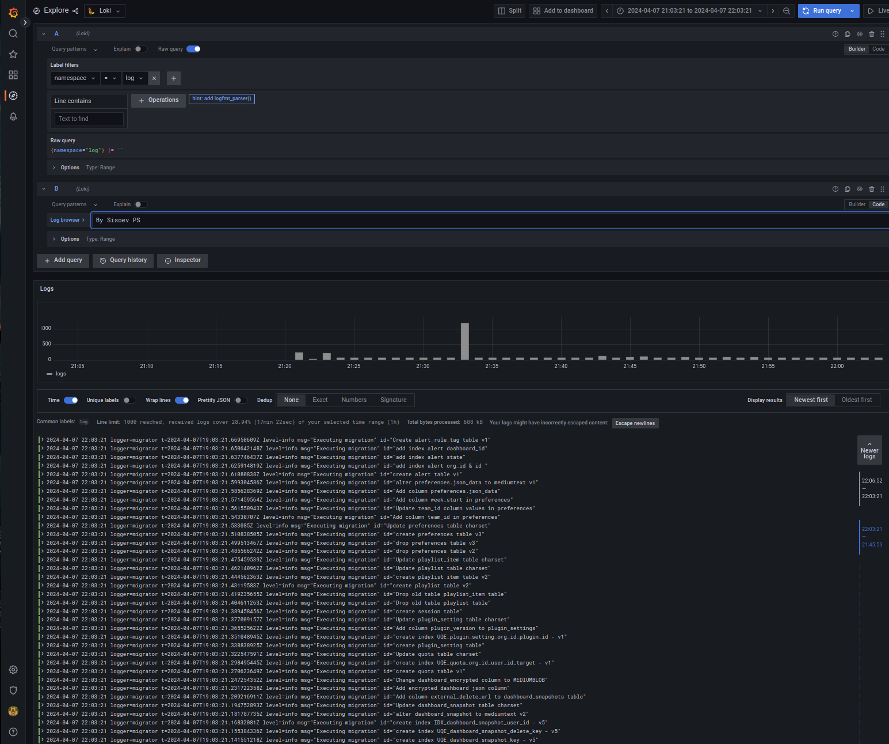

# Конфигурация системы Grafana

## Содержание

- [Don't foget!](#dforget)
- [Где посмотреть результат?](#check)
- [О проекте](#about)
- [Начало работы](#getting_started)


## 🧐 Don't foget! <a name = "dforget"></a>

- Все изменения проиводятся локально с использованием утилиты helm

## 😉 Где посмотреть результат? <a name = "check"></a>

Cервис доступен в кластере, namespace log 

## 🧐 О проекте <a name = "about"></a>

- Grafana - Система мониторинга и отображения метрик

## 🔧 Начало работы <a name = "getting_started"></a>

 
```
helm dependency update grafana/
helm upgrade --install grafana ./grafana/ -n log
```



