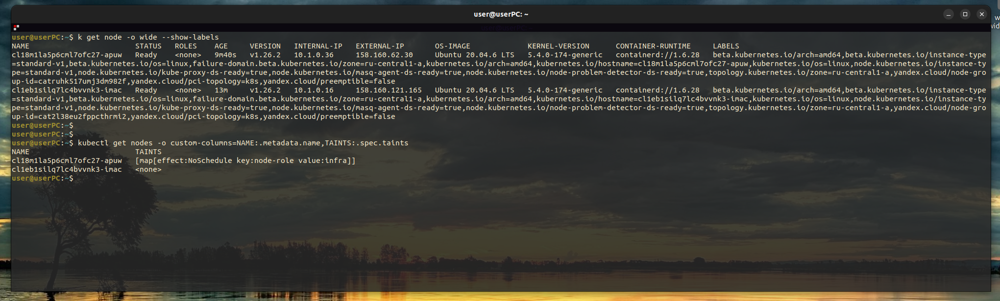

# Выполнение ДЗ Логирование

## Содержание

- [О проекте](#about)
- [Начало работы](#getting_started)
- [Добавленные изменения](#s)
- [Перечень полезных команд](#cmd)
- [Скриншоты](#q)


## 🧐 О проекте <a name = "about"></a>

Описана конфигурация 2х чартов

- Grafana - Система мониторинга и отображения метрик
- Loki - Система логирования с подключённым Yandex S3 storage


## 🔧 Начало работы <a name = "getting_started"></a>

Деплой Loki
```
export HELM_EXPERIMENTAL_OCI=1 && \
helm pull oci://cr.yandex/yc-marketplace/yandex-cloud/grafana/loki/chart/loki \
  --version 1.1.2 \
  --untar && \
helm upgrade --install -n log loki ./loki
```

Деплой Grafana
```
helm dependency update grafana/ && \
helm upgrade --install -n log grafana ./grafana/ 
```


## 🔧 Добавленные изменения <a name = "s"></a>
Деплой Loki
- Добавлена толерация (как для подов loki так и для promtail)
- Изменялась директива loki-distributed.loki.storageConfig.aws.bucketnames=<имя_бакета_Object_Storage> \
- Изменялась директива loki-distributed.serviceaccountawskeyvalue_generated.accessKeyID=<идентификатор_ключа_сервисного_аккаунта> \
- Изменялась директива loki-distributed.serviceaccountawskeyvalue_generated.secretAccessKey=<секретный_ключ_сервисного_аккаунта> 
Деплой Grafana
- Добавлена толерация

## 🔧 Перечень полезных команд <a name = "cmd"></a>
```  
yc init --federation-id=<federation-id>
yc config list
yc config profile create sisoev-sa-profile
yc iam service-account list  
yc config set cloud-id <id>
yc config set folder-id  <folder id>
export YC_TOKEN=$(yc iam create-token)
export YC_CLOUD_ID=$(yc config get cloud-id)
export YC_FOLDER_ID=$(yc config get folder-id)
yc iam access-key create --service-account-name < name >
```

```
access_key:
  id: <not using>
  service_account_id: <not using>
  created_at: <not using>
  key_id: <using>  <--- AWS_ACCESS_KEY_ID
secret: <using>  <--- AWS_SECRET_ACCESS_KEY
```

## 🔧 Скриншоты <a name = "s"></a>


